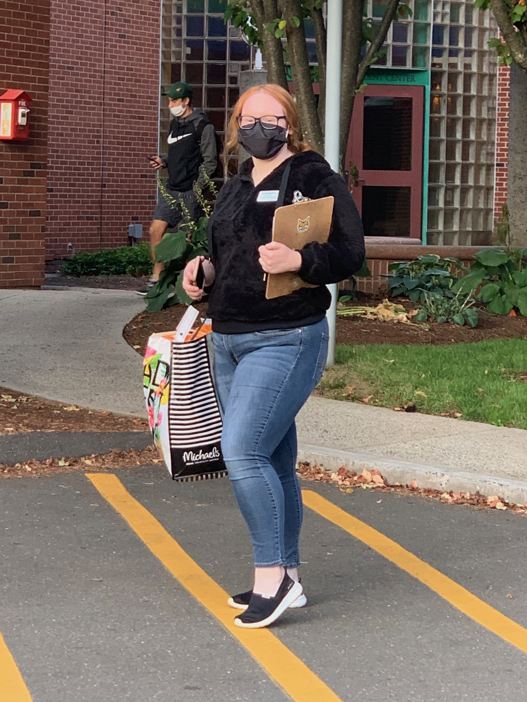
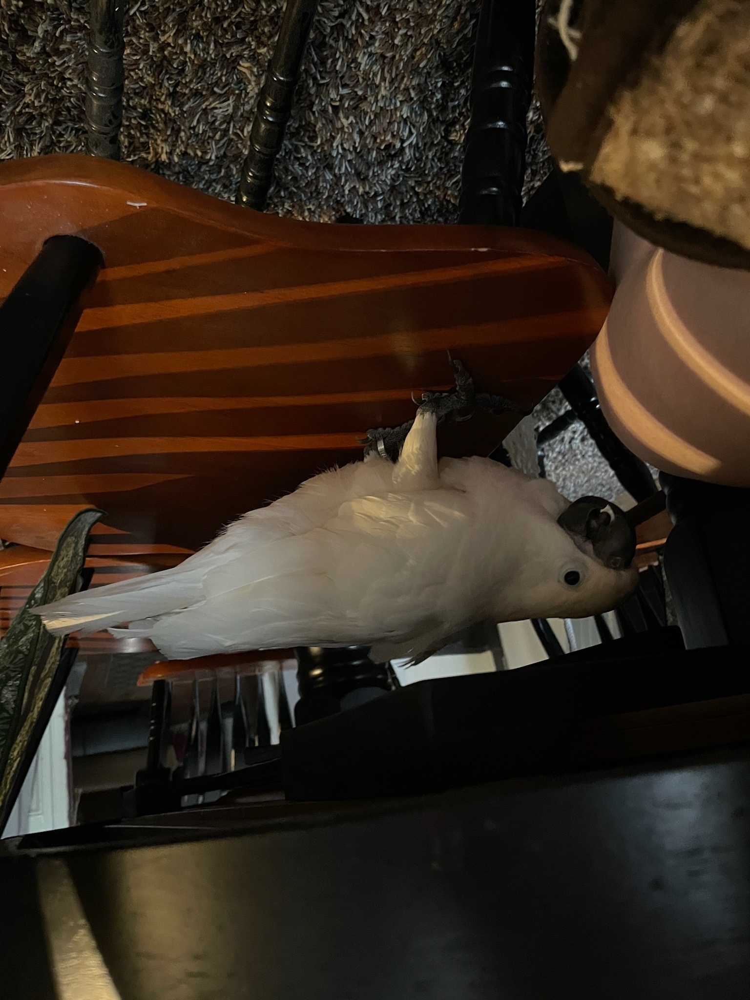
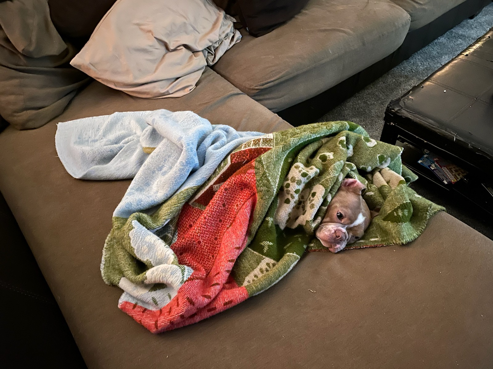

## High School
I had went to a technically highschool in Waterbury, CT. While attending the school I accoplished getting my hairdresser licenses at the age of 17.

## University 
I am currently a Junior studying Computer Science at Quinnipiac University.

## What got me into Computer Science
What made me change my career field was the creativity and complex thinking that goes with this field. While watching my father do personal projects on the side line of his work, is what really drove me into going to school. Using modern technology and creativity to create anything you want is what really sparks my intrest.

## Facts about Me

### Ashley Mills
- Age: 20
- Big 3: Leo sun and moon and Libra ascending.
- Accomplishments: License Cosmotologist (_HairColor Specilst_) 
- Siblings: 1 older brother
- Pets: 4 (_birds and 1 dog_)

## My Pets 
- Names: Baby, Gabby, Hazel, Lulu
- The bird in the photo is the youngest Lulu.

- Name: Roxi 

